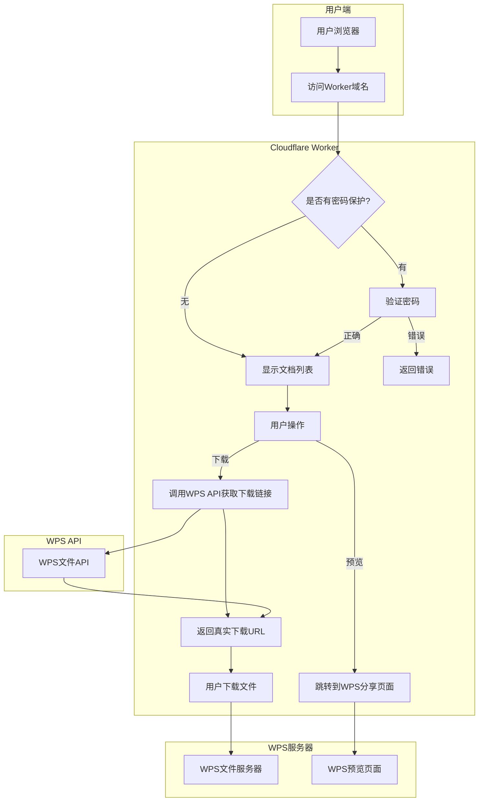
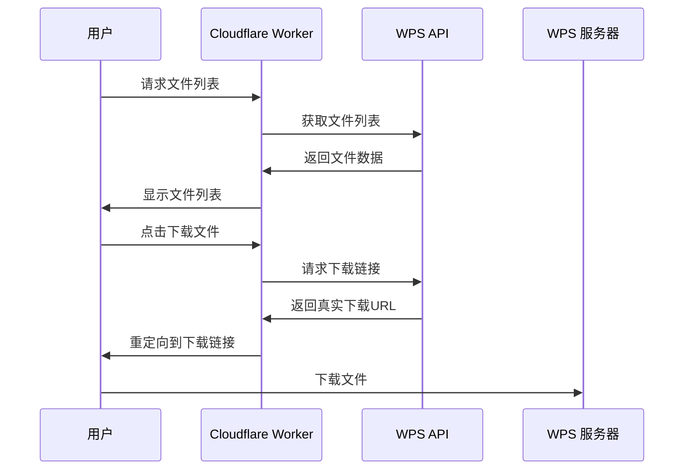
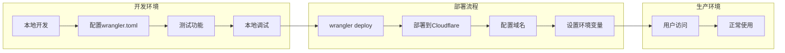

# WPS 云文档下载服务

基于 Cloudflare Worker 的 WPS 云文档外部下载服务，提供简洁的文档列表和下载功能。

## 功能特性

- 📄 文档列表展示（文件名、大小、更新时间、创建者）
- 🔗 直接下载功能（通过 WPS API 获取真实下载链接）
- 👁️ 在线预览支持（跳转到 WPS 分享页面）
- 🔐 可选密码访问保护
- 📱 响应式设计，支持移动端访问

## 快速开始

### 1. 安装依赖
```bash
npm install
```

### 2. 配置环境变量

复制配置模板：
```bash
cp wrangler.toml.example wrangler.toml
```

编辑 `wrangler.toml` 文件，填入您的 WPS 认证信息：

```toml
[vars]
WPS_GROUP_ID = "您的群组ID"
WPS_CORP_ID = "您的企业ID" 
WPS_COOKIES = "您的WPS Cookie字符串"
# 可选：访问密码
ACCESS_PASSWORD = "您的访问密码"
```

### 3. 本地开发
```bash
npm run dev
```

### 4. 部署到 Cloudflare
```bash
npm run deploy
```

## 环境变量配置

### 获取 WPS 认证信息

1. **WPS_GROUP_ID**: WPS 群组ID
2. **WPS_CORP_ID**: WPS 企业ID  
3. **WPS_COOKIES**: 从浏览器开发者工具中获取的完整 Cookie 字符串

### 安全配置

4. **ACCESS_PASSWORD** (可选): 网站访问密码，保护整个网站
5. **DIRECT_DOWNLOAD_PASSWORD** (可选): 直接下载认证密码，仅用于直接下载功能

### 认证层次

本系统提供两层认证机制：

1. **基础访问认证** (`ACCESS_PASSWORD`)
   - 保护整个网站访问
   - 如果设置，用户需要先通过此认证才能看到文件列表

2. **直接下载认证** (`DIRECT_DOWNLOAD_PASSWORD`) 
   - 仅用于直接下载功能的额外安全层
   - 如果不设置，直接下载功能将被禁用
   - 如果设置，用户点击直接下载时需要输入此密码

### Cookie 获取步骤

1. 登录 WPS 云文档
2. 打开浏览器开发者工具 (F12)
3. 切换到 Network 标签页
4. 刷新页面或进行操作
5. 找到 WPS 相关请求，复制 Request Headers 中的 Cookie 值

## 项目结构

```
365Worker/
├── worker.js              # 主要应用逻辑
├── wrangler.toml          # 本地配置（敏感信息，已忽略）
├── wrangler.toml.example  # 配置模板
├── package.json          # 项目依赖
├── .gitignore            # Git忽略规则
└── README.md             # 项目说明
```

## API 接口

- `GET /` - 主页面，显示文档列表
- `GET /api/files` - 获取文件列表 JSON
- `GET /api/folder?folderId={id}` - 获取指定文件夹内容
- `GET /download/{fileId}` - 通过代理下载文件
- `GET /direct-download/{fileId}` - 302重定向直接下载
- `POST /auth` - 密码验证接口

## 下载方式

本系统提供两种下载方式，用户可以根据网络环境选择：

### 1. 通过代理下载 (`/download/{fileId}`)
- **方式**: 通过Cloudflare Worker代理下载
- **优点**: 网络不稳定时也能正常下载，有重试机制
- **缺点**: 下载速度受Worker带宽限制
- **适用场景**: 网络环境较差或需要稳定下载时

### 2. 直接下载 (`/direct-download/{fileId}`)
- **方式**: 302重定向到真实下载链接
- **优点**: 下载速度更快，直接连接到WPS服务器
- **缺点**: 依赖网络环境，可能需要代理访问
- **适用场景**: 网络环境良好，追求下载速度时

### 下载流程图

```mermaid
graph TD
    U[用户] --> D[点击下载按钮]
    D --> O[选择下载方式]
    
    O -->|代理下载| P[/download/{fileId}]
    O -->|直接下载| R[/direct-download/{fileId}]
    
    P --> W1[Cloudflare Worker]
    W1 --> A1[WPS API获取下载链接]
    A1 --> W1
    W1 --> F1[WPS文件服务器]
    F1 --> W1
    W1 --> U[用户获得文件]
    
    R --> W2[Cloudflare Worker]
    W2 --> A2[WPS API获取下载链接]
    A2 --> W2
    W2 --> U2[302重定向]
    U2 --> F2[WPS文件服务器]
    F2 --> U[用户获得文件]
```

## 安全特性

- Cookie 认证：使用 WPS 原始认证信息
- 访问控制：可选密码保护
- CORS 支持：安全的跨域访问
- 错误处理：友好的错误提示
- 隐私保护：敏感配置文件已添加到 .gitignore

## 技术架构

- **前端**：纯 HTML + CSS + JavaScript
- **后端**：Cloudflare Worker
- **认证**：WPS Cookie 转发
- **下载**：两步式下载（API → 实际文件 URL）

## 使用说明

1. 访问部署后的域名
2. 如设置了密码保护，先输入访问密码
3. 浏览文档列表
4. 点击"下载文件"直接下载，或"在线预览"在 WPS 中查看

## 注意事项

- WPS Cookie 有有效期限制，需定期更新
- 文件下载链接有时效性（通常几小时）
- 建议在 Cloudflare 中设置适当的缓存策略
- 大文件下载可能受到 Worker 限制影响
- **重要**：wrangler.toml 包含敏感信息，切勿提交到版本控制

## 工作流程

### 系统架构流程图



### 下载流程图



### 部署流程图



## 开发

```bash
# 安装依赖
npm install

# 本地开发
npm run dev

# 部署
npm run deploy

# 查看日志
npm run tail
```

## 许可证

本项目仅供学习和研究使用。